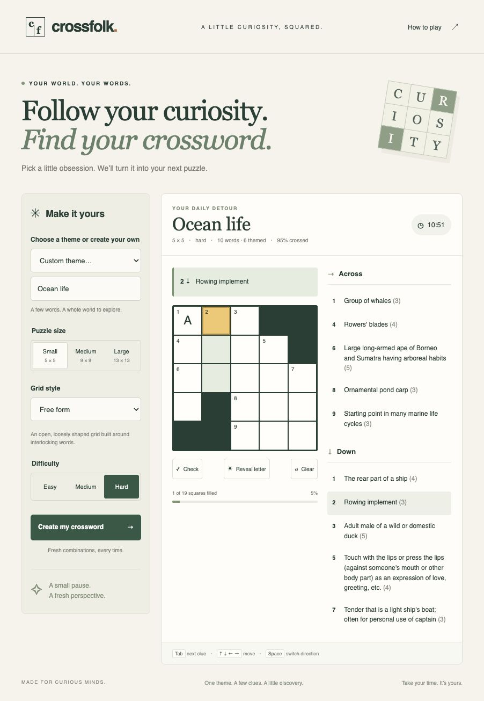

# Crossfolk

Crossfolk is a responsive, theme-based crossword game built with native JavaScript and a lightweight Node server. AI can
suggest answers and clues for custom themes; local code builds and checks every grid.



## Try it locally

```sh
npm start
```

Open http://localhost:3000. See [DEVELOPMENT.md](DEVELOPMENT.md) for Node requirements, local configuration, tests, and
the code guide.

## Play

Choose a theme, size, difficulty, and grid style. Small is 5×5, Medium is 9×9, and Large is 13×13; Small and Easy are
the initial settings. Ten curated theme families work without an API key: nature, ocean, space, food, music, travel,
sports, animals, weather, and garden. Custom themes need configured AI generation. See [DEPLOYMENT.md](DEPLOYMENT.md)
for credentials, database setup, and generation policy.

Click a clue or cell and type. Arrow keys move through the grid, Space switches direction at an intersection, and Tab
cycles clues while the grid has focus. Phones have an on-screen keyboard. Check marks wrong letters, Reveal fills the
selected letter, and Clear resets entered letters after confirmation. The timer pauses when the page is hidden; progress
and recent answer sets stay in browser storage.

## Grid styles

- **Free form** works at every size and requires a strict majority of themed answers. General words complete the
  crossings. Small Hard puzzles require at least 90% crossing coverage and 19 playable squares.
- **American style** is the default preference at 9×9. It uses a rotationally symmetric grid with every letter crossed
  and a pair of featured theme entries instead of a themed majority.

The generator rejects answer sets from the last 100 locally saved games. If it cannot make a fresh valid puzzle, it
reports the problem instead of relaxing the rules. Generation runs in a web worker so the controls stay responsive.

## More information

- [DEVELOPMENT.md](DEVELOPMENT.md): local setup, verification, architecture, and vocabulary.
- [DEPLOYMENT.md](DEPLOYMENT.md): Cloudflare and Docker setup, AI configuration, limits, and operations.
- [docs/crosswords-algorithm.md](docs/crosswords-algorithm.md): background on crossword generation.

Additional short answers and definitions come from [Princeton WordNet 3.0](https://wordnet.princeton.edu/). Its license
is in [public/WORDNET-LICENSE.txt](public/WORDNET-LICENSE.txt) and the generated dictionary module.
